## Getting Things Done (GTD)

[Source](https://gettingthingsdone.com/) by David Allen. [[acronym.CCORE]] is a
set of principles, a workflow, and a set of tools to help you get things done.

## STEP 1 CAPTURE

Collect what has your attention Write, record, or gather any and everything that
has your attention into a collection tool.

## STEP 2 CLARIFY

Process what it means Is it actionable? If so, decide the next action and
project (if more than one action is required). If not, decide if it is trash,
reference, or something to put on hold.

## STEP 3 ORGANIZE

Put it where it belongs Park reminders of your categorized content in
appropriate places.

## STEP 4 REFLECT

Review frequently Update and review all pertinent system contents to regain
control and focus.

## STEP 5 ENGAGE

Simply do Use your trusted system to make action decisions with confidence and
clarity.

```mermaid
flowchart TD
    Start([Incoming Item]) --> Capture

    %% STEP 1: CAPTURE
    Capture[📥 STEP 1: CAPTURE<br/>Collect what has your attention<br/>Write, record, or gather everything]

    Capture --> Clarify

    %% STEP 2: CLARIFY
    Clarify{🤔 STEP 2: CLARIFY<br/>Process what it means<br/>Is it actionable?}

    Clarify -->|No| NonActionable{What is it?}
    NonActionable -->|Trash| Trash[🗑️ Delete/Discard]
    NonActionable -->|Reference| Reference[📚 Reference Material<br/>Store for later lookup]
    NonActionable -->|Someday/Maybe| SomedayMaybe[💭 Someday/Maybe List<br/>Put on hold]

    Clarify -->|Yes| Actionable{Can it be done<br/>in 2 minutes?}

    %% Quick Actions
    Actionable -->|Yes| DoNow[✅ Do It Now<br/>Complete immediately]

    %% Longer Actions
    Actionable -->|No| MultiStep{Multiple steps<br/>required?}
    MultiStep -->|No| NextAction[📋 Next Action<br/>Single action item]
    MultiStep -->|Yes| Project[🎯 Project<br/>Multiple actions needed]

    %% STEP 3: ORGANIZE
    NextAction --> Organize1[📂 STEP 3: ORGANIZE<br/>Put in appropriate context lists]
    Project --> Organize2[📂 STEP 3: ORGANIZE<br/>Add to projects list<br/>Define next action]
    Reference --> Organize3[📂 STEP 3: ORGANIZE<br/>File in reference system]
    SomedayMaybe --> Organize4[📂 STEP 3: ORGANIZE<br/>Add to someday/maybe list]

    %% STEP 4: REFLECT
    Organize1 --> Reflect[🔄 STEP 4: REFLECT<br/>Weekly Review<br/>Update and review all systems]
    Organize2 --> Reflect
    Organize3 --> Reflect
    Organize4 --> Reflect

    %% STEP 5: ENGAGE
    Reflect --> Engage[🎯 STEP 5: ENGAGE<br/>Use trusted system to make<br/>action decisions with confidence]

    %% Completion and Loop
    DoNow --> Complete[✨ Complete]
    Engage --> Complete
    Trash --> Complete
    Complete --> Start

    %% Styling
    classDef captureStyle fill:#e1f5fe
    classDef clarifyStyle fill:#f3e5f5
    classDef organizeStyle fill:#e8f5e8
    classDef reflectStyle fill:#fff3e0
    classDef engageStyle fill:#fce4ec
    classDef actionStyle fill:#e0f2f1
    classDef completeStyle fill:#f1f8e9

    class Capture captureStyle
    class Clarify,NonActionable,Actionable,MultiStep clarifyStyle
    class Organize1,Organize2,Organize3,Organize4 organizeStyle
    class Reflect reflectStyle
    class Engage engageStyle
    class NextAction,Project,DoNow actionStyle
    class Complete,Trash completeStyle
```

