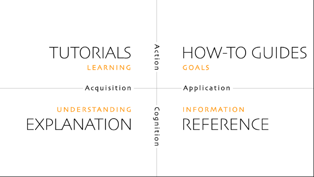

## C.O.D.E. Your Knowledge

**A software engineers attempt at documentation** [Wellington .NET User Group -
Event][wellidotnet-event]

### Details

Context is key. Knowledge is power. Documentation... is usually an afterthought.

We, as software engineers, are masters of turning complex requirements into
elegant code. But let's be honest, documentation often feels like that one chore
we keep putting off. This talk explores a fundamental question:

Are we truly converting information into lasting knowledge, or are we just
leaving behind cryptic comments and outdated READMEs?

Join Johannes Prinz as we explore how to apply the principles we use every day
in our code to more easily write documentation alongside our awesome software.
You'll walk away with concepts, principles, frameworks, and tools to explore in
our collective quest to become better, more well-rounded software engineers (and
maybe even enjoy writing documentation a little bit more!).

Whether you’re a seasoned developer or just getting started, you’ll leave with
practical ideas and inspiration to become a more well-rounded engineer — and
maybe even start to enjoy writing documentation.

Don't miss this chance to learn, network, and be inspired.

### Synopsis

Context is the key, knowledge is power. We, as software engineers, are masters
of turning complex requirements into elegant code. But let's be honest,
documentation often feels like that one chore we keep putting off. This talk
explores a fundamental question: Are we truly converting information into
lasting knowledge, or are we just leaving behind cryptic comments and outdated
READMEs? Join me as we explore how to apply the principles we use every day in
our code to more easily write documentation alongside our awesome software.
You'll walk away with concepts, principles, frameworks, and tools to explore in
our collective quest to become better, more well-rounded software engineers (and
maybe even enjoy writing documentation a little bit more!).

#### TLDR

Context is the key, knowledge is power. What is Software Engineering? Are we
converting information into knowledge? Using what we know about writing code to
more easily write documentation alongside our awesome software. This talk will
walk you through concepts, principles, frameworks and tools to explore in the
quest to become better software engineers.

### Outcomes

You discover a new tool or framework to explore, have a positive shift in
perspective on adding context to your code.

### Outline

- Intro
  - Story hook - Story, looking at code, who wrote this? Git Blame? Ohh shit it
    was me. Why did I do that? - Source code needs to capture the why what how,
    docs, tests, code - I’m going to try and explain how do we can do this?
  - This is me
    - use my gravatar image, link to my website <https://www.johannesprinz.com>
      link to my github profile.
  - Outcome
    - You'll walk away with concepts, principles, frameworks, and tools to
      explore in our collective quest to become better, more well-rounded
      software engineers (and maybe even enjoy writing documentation a little
      bit more!). You discover a new tool or framework to explore, have a
      positive shift in perspective on adding context to your code.
  - Premise
    - The quote "software is the manifestation of what we know" is attributed to
      [Harold Abelson][hal], a professor of Electrical Engineering and Computer
      Science at MIT. He is known for emphasizing the importance of writing
      clean, understandable code and ensuring that the process of coding
      facilitates human understanding.
      [Inspiring-software-development-quotes][quotes]
    - What is the process of Software Engineering?
      - We are creating knowledge, and the best way is via learning.
      - We learn best through play and experimentation.
- Body
  - For every tool below one slide, with hero graphic and link to relevant
    resources. Need to add speaker notes to each and try to demo as much as I
    can
- Conclusion
  - This will be all speaker notes with only a hero image "the future is neigh"
  - Hope you saw something new. In any case the real reason I want you all to
    think about improving your documentation is to improve your code. And
    provide another perspective on your code.
  - English language is the new abstraction. With AI tools we need to get better
    at describing the problem and the constraints for any proposed solutions.
    The documentation is more important than ever to get right. But so is
    creating human readable abstractions from what the AIs generate at the code
    level. Many perspectives of the same thing, gives us more orotundity to
    learn.

30 minutes on tools

### Context

What we do changes much slower than how we do it. Frameworks come and go, as a
principle we should be optimising for changeability. Knowledge will outlive the
programming languages we encode it in.

### Tools and Frameworks

- [Why - What - How][why-what-how] Every commit should have a why, what and how.
  We are great at the how (the code), some are getting better at what (the
  tests) but often it is the Why and decisions and trade-offs that are missing
  (the documentation).
- [Markdown][markdown] Can we agree that this is much better that WYSIWYG
  editors? Google docs has native support. And it's fast becoming the language
  of AI
- Style guide [Engineering Documentation • Lorna Jane Mitchell • GOTO
  2022][lorna]
  - Use templates (types)
  - add hyperlinks (references)
  - use active wording (naming conventions)
  - formatting guidelines (linters)
  - positive and respectful language
  - title, verbs and sentence case
  - screenshots and examples values
  - what not to do
- C.O.D.E [Develop a Second Brain - Michela Bertaina - NDC London 2025][michela]
  - Collect (make it work)
  - Organise (refactor)
  - Distil (reuse)
  - Express (build once publish many times)
- Running Notes (As build documentation) [Keynote: Steps to Wisdom - Kate
  Gregory - NDC TechTown 2023][kate]
- Dendron [dendron]
  - Create a note
  - Refactor
  - Show graph
  - acronyms (Augmenters)
- [Diátaxis][diátaxis] Acquisition, Action, Application, Cognition (types or
  templates) 
  - Tutorials
  - How-to guides
  - Explanations
  - References
  - Do we name by what it does of what it is? Reference to good architecture.
    What it does should be the first class citizen. How it does it is
    implementation specifics and should be well abstracted (Hexagonal or onion
    architecture) Talk about common antipatterns when it comes to solution
    layout.
- [ADRs][adr]
  - [adr-tools][adr-tools]
- [C4Model][c4model]
  
  - System Landscape diagram
  - Deployment diagram
  - [Diagramming checklist][diagram-checklist]
  - [Structurizr][structurizr]
    - `docker run -it --rm -p 8080:8080 -v $(pwd):/usr/local/structurizr structurizr/lite`
    - Diagrams type of aggregator
- [Mermaid][mermaid]
  - [Live editor][mermaid live]
- [Arc42][arc42] (templates)
  - Canvas is an aggregator
- [Beyond the twelve factor app][beyond-12-factor] to accommodate current best
  practices, this practical book expands on the original guidelines to help you
  build applications that not only function in the cloud but also thrive (
  [Original source][twelve-factor]). [The 12 factor app][twelve-factor-app] In
  2012, early cloud pioneer Heroku developed the Twelve-Factor App, a set of
  rules and guidelines for helping organizations build cloud native
  applications.

  - Chapter 1: One Codebase, One Application
  - Chapter 2: API First
  - Chapter 3: Dependency management
  - Chapter 4: Build, Release, Run
  - Chapter 5: Configuration, Credentials, Code
  - Chapter 6: Logs
  - Chapter 7: Disposability
  - Chapter 8: Backing Services
  - Chapter 9: Environment Parity
  - Chapter 10: Administrative Processes
  - Chapter 11: Port Binding
  - Chapter 12: Stateless processes
  - Chapter 13: Concurrency
  - Chapter 14: Telemetry
  - Chapter 15: Authentication and Authorization

- Pipelines
- For every type of code asset we have, linters, compilers, package once deploy
  many times write once publish many times
- How can we make this even better?
- Aggregators, Summarisers, Augmenters

[adr-tools]: https://github.com/npryce/adr-tools
[adr]: https://adr.github.io/adr-templates/
[arc42]: https://arc42.org/
[c4model]: https://c4model.com/
[dendron]: https://www.dendron.so/
[diagram-checklist]: https://c4model.com/diagrams/checklist
[diátaxis]: https://diataxis.fr/
[hal]: https://en.wikipedia.org/wiki/Hal_Abelson
[kate]: https://www.youtube.com/watch?v=iS9mbqho6s0
[lorna]: https://www.youtube.com/watch?v=Z5OrR99OpiY&t=1018s
[markdown]: https://www.markdownguide.org/
[mermaid live]: https://mermaid.live/edit
[mermaid]: https://mermaid.js.org/
[michela]: https://www.youtube.com/watch?v=6KSVDvPnUpU
[quotes]:
  https://blog.rarecrew.com/post/inspiring-software-development-quotes-to-fuel-your-coding-journey
[structurizr]: https://structurizr.com/
[wellidotnet-event]: https://www.meetup.com/wellidotnet/events/308565157/
[why-what-how]:
  https://www.johannesprinz.com/posts/03-software-engineering-quickstart-guide/
[beyond-12-factor]:
  https://raw.githubusercontent.com/ffisk/books/master/beyond-the-twelve-factor-app.pdf
[twelve-factor]:
  https://tanzu.vmware.com/content/ebooks/beyond-the-12-factor-app
[twelve-factor-app]: https://12factor.net/
