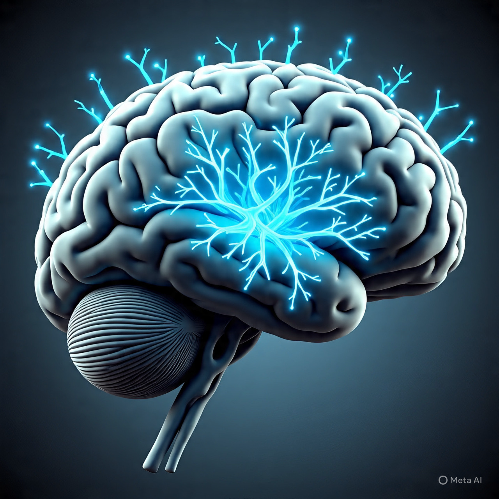

<!-- _class: lead -->

# **C.O.D.E. Your Knowledge**

## A Software Engineer's Attempt at Documentation

**Johannes Prinz**
[Wellington .NET User Group](https://www.meetup.com/wellidotnet/events/308565157/)


---

<!-- _class: lead -->

# Look 🙈 or sound 🙉 familiar?

```bash
$ git log --oneline -1
a1b2c3d Fix critical bug in payment processing

$ git blame PaymentProcessor.cs
a1b2c3d (Johannes Prinz 6 months ago) // TODO: This is a hack
```

**Who wrote this?** 🤔  
**Why did I do that?** 😱

---

# This is me


## Johannes Prinz

🌐 [johannesprinz.com](https://www.johannesprinz.com)
🐙 [https://github.com/johannesprinz](https://github.com/johannesprinz)
👨‍💻 [www.linkedin.com/in/johannesprinz](https://www.linkedin.com/in/-johannesprinz/)
💼 Software Engineering Practice Manager @ msd.govt.nz

---

# So what is Software Engineering?

> **"Software is the manifestation of what we know"**
>
> — Harold Abelson, MIT

<!--

The quote "software is the manifestation of what we know" is attributed to
      [Harold Abelson][hal], a professor of Electrical Engineering and Computer
      Science at MIT. He is known for emphasizing the importance of writing
      clean, understandable code and ensuring that the process of coding
      facilitates human understanding.
      [Inspiring-software-development-quotes][quotes]
    - What is the process of Software Engineering?
      - We are creating knowledge, and the best way is via learning.
      - We learn best through play and experimentation.
[hal]: https://en.wikipedia.org/wiki/Hal_Abelson
[quotes]:
  https://blog.rarecrew.com/post/inspiring-software-development-quotes-to-fuel-your-coding-journey

 -->

---

# Guiding Principles

What we **do** changes much slower than **how** we do it...

- Build for **changeability** and **knowledge preservation**.
- Seek many perspectives to **understand** the problem.

**... and principles endure.**
<!-- 
- Frameworks come and go
- Languages evolve
- Tools change daily
 -->
---

# My hope today is

You'll walk away with:

✅ **Concepts** - New ways to think about documentation and how you engineer solutions  
✅ **Principles** - Guidelines that transcend tools  
✅ **Frameworks** - Structured approaches to knowledge capture  
✅ **Tools** - Practical solutions you can use tomorrow

_And maybe even enjoy writing documentation a little bit more!_ 😊

---

# Why what how


Context is king, do all you commits have the full context?

<!--

- The Why ( Values, Documentation, Commit messages, Comments )
- The What ( Principles, Documentation, Tests )
- The How ( Process, Architecture, Code, Tools )

https://www.johannesprinz.com/posts/03-software-engineering-quickstart-guide/
[Markdown](https://www.markdownguide.org/) Can we agree that this is much better that WYSIWYG
editors? Google docs has native support. And it's fast becoming the language
of AI

    Note tickets are transient artefacts, they are not your requirements management system.
 -->
---

[](ttps://www.youtube.com/watch?v=iS9mbqho6s0)
[](https://www.youtube.com/watch?v=Z5OrR99OpiY&t=1018s)
[](https://www.youtube.com/watch?v=6KSVDvPnUpU)

<!--
- Running Notes (As build documentation) [Keynote: Steps to Wisdom - Kate
  Gregory - NDC TechTown 2023][kate]
- Style guide [Engineering Documentation • Lorna Jane Mitchell • GOTO
  2022][lorna]
  - Use templates (types)
  - add hyperlinks (references)
  - use active wording (naming conventions)
  - formatting guidelines (linters)
  - positive and respectful language
  - title, verbs and sentence case
  - screenshots and examples values
  - what not to do
- C.O.D.E [Develop a Second Brain - Michela Bertaina - NDC London 2025][michela]
  - Collect (make it work)
  - Organise (refactor)
  - Distil (reuse)
  - Express (build once publish many times)

-->

---

# Dendron

[Demo Time](https://www.dendron.so/)


<!--
  - Part of the capture and organise steps
  - Create a note
  - Refactor
  - Show graph
  - acronyms 
  - Introduce the concept of (Augmenters)
  - doctor cli
-->
---

# Diataxis Framework

[Demo Time](https://diataxis.fr/)


<!--
More useful templates and guides, great for prompting AI to adhere to when creating content with assistance.
Who are we writing this information for? What is the purpose of this documentation?
Be kind to your future self.
-->

---

 # Architecture Decisions Records

[Demo Time](https://github.com/npryce/adr-tools)
[](https://adr.github.io/adr-templates/)

<!--
Good template to use for capturing decision.
Should you capture every decision this way?
-->
---

# Mermaid JS

[Demo Time](mermaid.live)


---

# C4 Model

[Demo Time](https://c4model.com/)


<!--
- Pictures are worth a thousand words
- Introduces the 4 levels of abstraction for software architecture
- [C4Model](https://c4model.com/)
  - System Landscape diagram
  - Deployment diagram
  - [Diagramming checklist](https://c4model.com/diagrams/checklist)
  - [Structurizr](https://structurizr.com/)
  - `docker run -it --rm -p 8081:8080 -v $(pwd):/usr/local/structurizr structurizr/lite`
  - http://localhost:8081/workspace/documentation

  - Diagrams type of aggregator and change of perspective.
-->
---

# Arc42

[Demo Time](https://arc42.org/)


<!--
More templates and guides, great for prompting AI to adhere to when creating content with assistance.
-->

---

<!-- _class: lead -->

# Where to from here?

<!--
AI is introducing yet another abstraction
AI is a great translator, get it to help you gain more perspectives.
And see how you can use some of the tools to automate documentation generation
as part of your development pipelines
-->
## Your Next Steps

1. **Try one tool** from today's session
2. **Apply the C.O.D.E. method** to your current project
3. **Share your learnings** with your team
